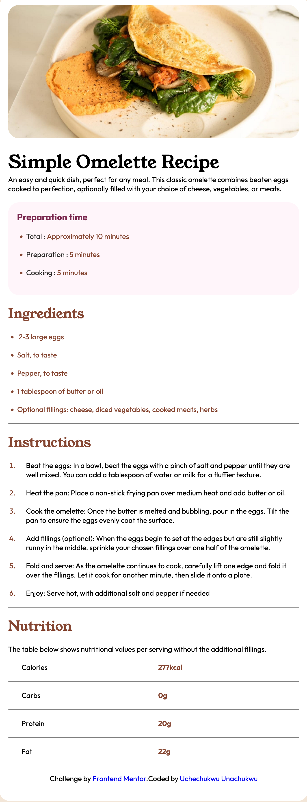
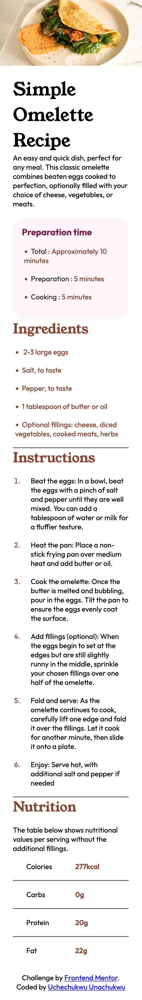

# Frontend Mentor - Recipe page solution

This is a solution to the [Recipe page challenge on Frontend Mentor](https://www.frontendmentor.io/challenges/recipe-page-KiTsR8QQKm). 

## Table of contents

- [Overview](#overview)
  - [The challenge](#the-challenge)
  - [Screenshot](#screenshot)
  - [Links](#links)
- [My process](#my-process)
  - [Built with](#built-with)
  - [What I learned](#what-i-learned)
  - [Continued development](#continued-development)
  - [Useful resources](#useful-resources)
- [Author](#author)


**Note: Delete this note and update the table of contents based on what sections you keep.**

## Overview

The project overview was to build a simple omelette recipe on some kind of "card". (if i can call it that). I was supposed to build a mobile version and a desktop version and I did the best I could. I built the desktop version and only one mobile version. On the desktop version, I used an overall containing div which i called a wrapper div and gave it some padding. The wrapper div has a child that then "housed" the sections on my website. The "card" i referred to in the first sentence of this project overview was my wrapper div with a white background. My website has 6 sections. The css grid layout was used in the nutrition section on the desktop version. The css flexbox layout was used in the atribution section on the desktop version.

The mobile version was done with only one media breakpoint (screen-width:576px). I used the css flexbox layout on the inner wrapper (which is the child to the wrapper div) to force all the flex items in it to line up in one column. The omelette image was made to span the full width of the screen by just increased the width of its parent div to 100vw. Also the atrribution section in the mobile version was adjusted with the css flexbox layout to make the text inside to sit in the centre of its parent div.


### Screenshot

<!-- desktop version -->
 

<!-- mobile version -->



### Links

- Solution URL: (https://github.com/Ucheklinks/omelette_recipe)
- Live Site URL: (https://omelette-recipe-lemon.vercel.app/)

## My process

### Built with

- Semantic HTML5 markup
- CSS custom properties
- Flexbox
- CSS Grid


**Note: These are just examples. Delete this note and replace the list above with your own choices**

### What I learned

I just started web development and I think I am enjoying it. This project gave me the opportunity to once more practice my media breakpoint skills. It has somewhow always been a problem. Apart from that, the nutrition section on the website (I divided my website into sections), was a little bit tricky. You can see how i approached the issue below with my html and css code. I also noticed something weird with the horizontal rule: I found it hard to fit in into my grid because i turned all the divs in my nutrition section to a grid. The <hr/> element turned to something that resembled a text box (if memory serves me correctly). I also learnt from how to use variables in css which i found very helpful. It helped speed up my work.

The folowing are the code snippets of the html and css for the nutrition section of my website, see below:

```html
 <section class="nutrition section_spacing">
        <h2>Nutrition</h2>
        <p>  The table below shows nutritional values per serving without the additional fillings.</p>
        <div>
          <p>Calories</p>
          <p class="brown_column">277kcal</p>
        </div>
        <hr>
        <div>
          <p>Carbs</p>
          <p class="brown_column">0g</p>
        </div>
        <hr>
        <div>
          <p>Protein</p>
          <p class="brown_column">20g</p>
        </div>
        <hr>
        <div>
          <p>Fat</p>
          <p class="brown_column">22g</p>
        </div>
  
      </section>
```
```css
.nutrition > div{
    display: grid;
    grid-template-columns: 1fr 1fr;
    grid-template-rows: 1fr;
    margin-left: 10px;
    padding: 20px;
    
}

.brown_column{
    color: var(--brown800); 
    font-weight: 600;
    padding-left: 5px;
}

.nutrition > h2{
    padding-bottom: 20px;
}

/* attribution section */
section > .attribution{
    display: flex;
    justify-content: center;
}

```
`


### Continued development

I need to still work on the responsiveness and the media breakpoints across different devices on websites in order to solidify my knowledge.


## Author

- Website - [Uchechukwu Unachukwu](https://web-design-with-grid-wscg.vercel.app/)
- Frontend Mentor - [@Ucheklinks](https://www.frontendmentor.io/profile/Ucheklinks)
- Twitter - [@slipdripflip](https://www.twitter.com/yourusername)


